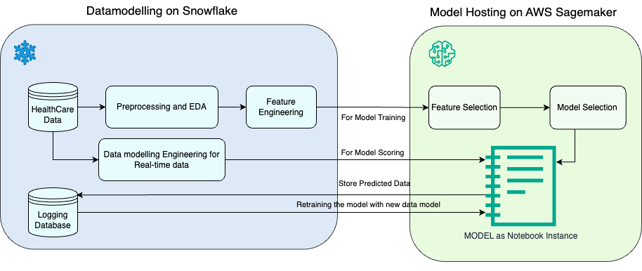

### Healthcare Analytics
This repo is an analysis of patient length of stay that can help providers to improve patient outcomes and reduce costs. By leveraging data and advanced analytical techniques, healthcare providers can gain a deeper understanding of patient needs and identify opportunities to improve the delivery of care.
* * *

### Goal:
To predict the Length of stay(LOS) of each patient by implementing an ML model fed by data, which is feature-engineered as a result of EDA on a vast dataset of Hospital log history. 

### Architecture Diagram:


### Tech Stack:
* **Snowflake**: Warehouse managament
* **Sagemaker**: To host notebook instance
### Prerequisites:
* Knowledge on ML algorithms (classification and regression)
* Python (Pandas) and SQL

### Implementation:
#### 1. Create the database and table:
For Snowflake to host the data, create a database and table to stage and load data from local. Here's the script: [create_db_and_table](scripts/Snowflake_eda.sql)


#### 2. Perform EDA:
Snowflake provides in-house visualization of the data weights when you select all columns from the table (```select * from health_data```) for a quick overview. However, it's important to understand the behvaior of ```discharge_data``` w.r.t one or more columns in the table. With logical reasoning, perform EDA on the database to identify patterns in any. Here's my take on EDA: [snowflake_eda](scripts/Snowflake_eda.sql)

#### 3. Feature Engineering:
From the insights captured from EDA, create new columns combining 2 or more correlating features. To train the models over the LOS, add a desginated LOS column. Here is the script: [feature_engineering](scripts/feature_engineering.sql)

#### 4. Data Preprocessing:
Databases are good at querying and Pandas are good at data manipulation. The data is copied to pandas for preprocessing.
* Create a notebook instance on Sagemaker
* Import python-sql-connector and snowflake-sqlalchemy to load data from Snowflake to the python script
* Drop Irrelevant Rows
* Categorize columns into objects and integers
* Perform one-hot encoding on the object columns

#### 5. Train Data for Feature Selection:
To find the features with the highest impact on LOS, perform Dtree and XGB selections, and the resultant feature set is stored using Union and is used for building the ML model.

#### 6. Build the model:
* Train the new features on Linear Regression, XGB Regression, Random Forest Regression.
Hyperparameter tuning, voting, bagging, etc, are not performed as the focus is on demonstrating the workflow.

#### 7. Deploy the script:
#### 8. Schedule/Retrain?
